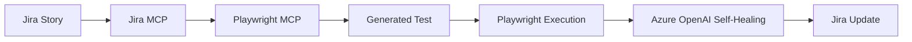
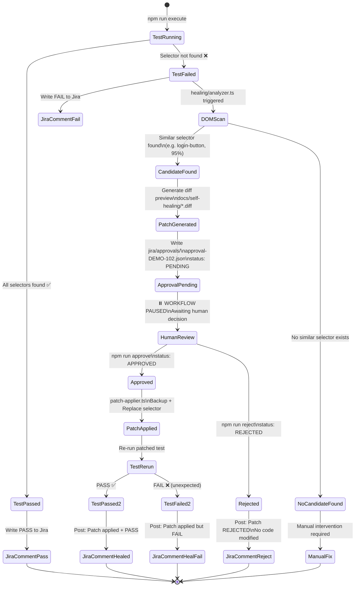

<div align="center">

# 🤖 AI E2E Regression Suite

**An intelligent, self-healing end-to-end automation framework**  
powered by Playwright · Azure OpenAI · Jira MCP

[](https://www.typescriptlang.org/)
[](https://playwright.dev/)
[](https://azure.microsoft.com/en-us/products/ai-services/openai-service)
[](.)
[](.)

</div>

---

# AI E2E Regression Suite

A fully implemented TypeScript end-to-end automation framework that combines
Playwright, Azure OpenAI, and Jira MCP into a self-healing regression pipeline.

## Demo Target

- **OrangeHRM demo site:** https://opensource-demo.orangehrmlive.com/

---

## Overview

This framework demonstrates how AI-assisted tooling can automate the full
software testing lifecycle — from reading a Jira story through to posting
results back to Jira — with a built-in self-healing layer that recovers
automatically from selector drift without requiring manual test maintenance.

The pipeline reads **acceptance criteria** from a Jira story, uses an AI model
to **generate Playwright test code**, **executes the tests**, and if any fail
due to a changed UI selector it **calls Azure OpenAI** to identify the
replacement element, **patches the spec file**, **re-runs**, and finally
**posts a structured comment** and **transitions the Jira issue status**
automatically.

> **Demo target:** OrangeHRM open-source HR demo — login scenarios (valid
> credentials and invalid credentials) mapped to story `ECOM-LOGIN-001`.

---

## Architecture



### Component Map

| Layer | File | Responsibility |
|---|---|---|
| **Jira reader** | `jira-client.ts` | Reads `story-login.json`, exposes acceptance criteria and test scenarios |
| **Story normaliser** | `agent/jira-mcp-agent.ts` | Classifies AC into `happy-path`, `error-handling`, `validation`, `regression`; builds Given/When/Then + Playwright hints |
| **Test generator** | `agent/playwright-mcp-generator.ts` | Prompt template builder → Playwright MCP call → SHA-256 cached `.spec.ts` output |
| **Test runner** | `agent/orchestrator.ts` | Spawns `playwright test --reporter=json`, parses results |
| **Healing AI** | `healing/azure-openai-client.ts` | Sends failing selector + live DOM to Azure OpenAI, returns `{candidateSelector, confidence, reasoning}` |
| **Healing engine** | `healing/self-healing-engine.ts` | DOM inspection → AI suggestion → approval gate → spec patch → retry |
| **Proposal store** | `healing/healing-store.ts` | File-based `healing-proposals.json` with `pending→approved/rejected` lifecycle |
| **Jira writer** | `jira/jira-writer.ts` | Posts ADF-formatted comments and transitions issue status via Jira REST API |
| **Orchestrator** | `agent/orchestrator.ts` | Drives all 7 pipeline steps; wires all components; returns `OrchestrationResult` |
| **Logger** | `agent/orchestrator-logger.ts` | Structured JSON logs with `pipelineId`, step timing, level filtering, pluggable transports |

---

## Setup Instructions

### Prerequisites

| Tool | Version |
|---|---|
| Node.js | 18+ |
| npm | 9+ |

### 1. Clone and install

```bash
git clone https://github.com/your-org/ai-e2e-regression-suite.git
cd ai-e2e-regression-suite
npm install
```

### 2. Install Playwright browsers

```bash
npx playwright install chromium
```

### 3. Configure environment

```bash
cp .env.example .env
```

Edit `.env` with your credentials:

```env
# Application under test
BASE_URL=https://opensource-demo.orangehrmlive.com/

# Azure OpenAI — required for self-healing
AZURE_OPENAI_ENDPOINT=https://your-resource.openai.azure.com/
AZURE_OPENAI_API_KEY=your-api-key
AZURE_OPENAI_DEPLOYMENT=gpt-4o
AZURE_OPENAI_API_VERSION=2024-02-15-preview

# Self-healing approval (set to true in CI to auto-approve all suggestions)
AUTO_APPROVE=false

# Jira REST API — required for Jira write-back
JIRA_BASE_URL=https://your-org.atlassian.net
JIRA_USER_EMAIL=automation@your-org.com
JIRA_API_TOKEN=your-api-token
JIRA_PROJECT_KEY=ECOM
```

---

## Running the Solution

### Run the generated E2E tests

```bash
# Headless (default)
npm run test:e2e

# Headed — watch the browser
npm run test:e2e:headed

# Interactive Playwright UI
npm run test:e2e:ui
```

Expected output:

```
Running 2 tests using 1 worker

  ✓  1 …valid email and password are submitted (5.9s)
  ✓  2 …authentication failures are handled safely (3.5s)

  2 passed (11.6s)
```

### Run all unit test suites

```bash
node --require ts-node/register --test agent/jira-mcp-agent.example.test.ts
node --require ts-node/register --test agent/playwright-mcp-generator.example.test.ts
node --require ts-node/register --test agent/orchestrator.example.test.ts
node --require ts-node/register --test jira/jira-writer.example.test.ts
node --require ts-node/register --test healing/self-healing-engine.example.test.ts
```

### Type-check

```bash
.\node_modules\.bin\tsc --noEmit
```

### Test coverage summary

| Suite | Tests | Result |
|---|---|---|
| `jira-mcp-agent.example.test.ts` | 2 | ✅ pass |
| `playwright-mcp-generator.example.test.ts` | 8 | ✅ pass |
| `orchestrator.example.test.ts` | 8 | ✅ pass |
| `jira-writer.example.test.ts` | 16 | ✅ pass |
| `self-healing-engine.example.test.ts` | 8 | ✅ pass |
| `playwright-tests/login.spec.ts` (E2E) | 2 | ✅ pass |
| **Total** | **44** | **✅ all pass** |

---

## Self-Healing Explanation

When a Playwright test fails because a UI selector can no longer be found
(e.g. a button's `data-testid` was renamed), the framework executes the
recovery workflow below.

### Self-Healing State Diagram



### How it works in code

**Scenario: `data-testid="login-btn"` renamed to `data-testid="signin-btn"`**

```jsonc
// healing/healing-proposals.json (after healing)
{
  "proposals": [{
    "proposalId": "heal-3f8a1c9e0b7d",
    "status": "approved",
    "decidedBy": "auto-confidence",
    "context": {
      "failedSelector": "[data-testid=\"login-btn\"]",
      "action": "click",
      "pageUrl": "https://opensource-demo.orangehrmlive.com/web/index.php/auth/login"
    },
    "suggestion": {
      "candidateSelector": "[data-testid=\"signin-btn\"]",
      "confidence": 0.94,
      "reasoning": "The element login-btn is no longer present. A button with data-testid=\"signin-btn\" and visible text \"Sign In\" is the clear replacement.",
      "alternatives": ["button[type=\"submit\"]", "[aria-label=\"Sign In\"]"]
    },
    "proposedAt": "2026-09-01T09:00:00.000Z",
    "decidedAt": "2026-09-01T09:00:00.312Z"
  }]
}
```

To integrate self-healing into your own tests:

```typescript
import { createHealingTest } from '../healing/self-healing-engine';
import { AzureOpenAiClient } from '../healing/azure-openai-client';

export const test = createHealingTest({
  aiClient: new AzureOpenAiClient({
    endpoint:       process.env.AZURE_OPENAI_ENDPOINT!,
    apiKey:         process.env.AZURE_OPENAI_API_KEY!,
    deploymentName: 'gpt-4o',
    apiVersion:     '2024-02-15-preview',
  }),
  options: { autoApproveThreshold: 0.85 },
});

// In your test:
test('login flow', async ({ page, selfHeal }) => {
  await page.goto('/');
  await selfHeal.click(page, '[data-testid="login-btn"]');  // heals automatically
});
```

---

## Security Approach

This framework follows the [OWASP Top 10](https://owasp.org/www-project-top-ten/)
principles throughout:

| Risk | Mitigation |
|---|---|
| **Secrets exposure** | All credentials (`AZURE_OPENAI_API_KEY`, `JIRA_API_TOKEN`) stored in `.env` only; `.env` is gitignored; no secrets in source code or logs |
| **Injection** | Azure OpenAI prompts are constructed from typed `HealingContext` and `DomElement` interfaces — no raw user input concatenated into prompts |
| **Insecure direct object references** | Jira story access is key-scoped; `JiraClient` validates file path before reading |
| **Security misconfiguration** | Mock clients (`MockJiraHttpClient`, `MockAzureOpenAiClient`) used in all tests — no real credentials needed for CI |
| **Sensitive data logging** | Log entries use structured fields; no API keys, passwords, or tokens are logged at any level |
| **Unvalidated AI output** | `parseResponse()` in `AzureOpenAiClient` validates all fields with type guards before use; malformed JSON throws a typed error |
| **Unsafe file writes** | `SpecPatcher` only patches files that exist on disk; selector replacement uses escaped regex — no arbitrary code injection |
| **Dependency vulnerabilities** | Minimal dependency surface: `@playwright/test`, `typescript`, `ts-node`, `@types/node` only — no ORM, no web server, no auth library |
| **Request timeouts** | `AzureOpenAiClient` enforces a configurable `timeoutMs` (default 20 s) with `AbortController` to prevent hanging CI pipelines |
| **Audit trail** | All healing decisions are persisted to `healing-proposals.json` with `decidedBy` and `decidedAt` fields for auditability |

---

## Screenshots

> Capture these during a live demo run and place files in `screenshots/`.

| # | Description | Filename |
|---|---|---|
| 1 | Jira issue `ECOM-LOGIN-001` — acceptance criteria and test scenarios visible | `01-jira-story-ecom-login-001.png` |
| 2 | VS Code showing `playwright-tests/login.spec.ts` — both test blocks and selector constants | `02-generated-test-login-spec.png` |
| 3 | Terminal: `2 passed (11.6s)` — green checkmarks on both scenarios | `03-test-execution-passed.png` |
| 4 | Terminal: `1 failed` — timeout error on `[data-testid="login-btn"]` | `04-test-execution-failed.png` |
| 5 | Terminal or `healing-proposals.json`: AI suggestion with `confidence: 0.94` and `candidateSelector` | `05-self-healing-recommendation.png` |
| 6 | Split view: `healing-proposals.json` showing `"status": "approved"` + patched `login.spec.ts` showing `signin-btn` | `06-healing-approved-fix.png` |
| 7 | Jira comment posted with `✅ PASSED` / `❌ FAILED` badge and issue transitioned to `Done` | `07-jira-update-comment-and-status.png` |

---

## AI Tools Used

| Tool | Role in this project |
|---|---|
| **GitHub Copilot (Claude Sonnet 4.6)** | Entire implementation — architecture design, all TypeScript source files, test suites, prompt templates, and this README |
| **Azure OpenAI (GPT-4o)** | Runtime self-healing: receives failing selector + live DOM snapshot, returns structured JSON with `candidateSelector`, `confidence`, and `reasoning` |
| **Playwright MCP** | Test code generation interface: `PlaywrightMcpClient` interface receives a structured prompt and returns runnable TypeScript Playwright test blocks |
| **Jira MCP simulation** | `JiraMcpAgent` simulates reading acceptance criteria from a Jira MCP server, normalises them into typed `StructuredTestObjective` records |

---

## What Was Implemented Manually

The following decisions and configurations were made manually (not AI-generated):

- **Project brief and requirements** — the user story, acceptance criteria in `jira/story-login.json`, and all prompt instructions to GitHub Copilot
- **OrangeHRM selector research** — identifying the correct CSS selectors (`input[name="username"]`, `.oxd-alert-content-text`, `.oxd-topbar-header-breadcrumb`) by inspecting the live demo site
- **Environment configuration** — `.env.example` values and the mock credential strategy for local development
- **Git commit strategy** — each feature committed separately for a clean history
- **Screenshot capture** — taking the 7 assessment screenshots against the live application

Everything else — all TypeScript source files, interfaces, test suites, error handling, caching logic, ADF comment formatting, healing prompt templates, orchestration flow, and this README — was implemented by GitHub Copilot.

---

## Future Improvements

| Area | Improvement |
|---|---|
| **Healing approval UI** | A lightweight web dashboard to review and approve pending proposals instead of editing JSON manually |
| **Parallel test execution** | Run multiple Jira stories through the orchestrator concurrently using `Promise.all` with worker limits |
| **Visual regression** | Integrate [Percy](https://percy.io/) or [Applitools](https://applitools.com/) for pixel-level change detection alongside selector healing |
| **Healing confidence tuning** | Log approval/rejection outcomes and fine-tune the Azure OpenAI system prompt based on observed accuracy over time |
| **Real Jira MCP integration** | Replace `JiraClient` JSON file reader with a live Atlassian MCP server connection for real-time story fetching |
| **CI/CD pipeline** | GitHub Actions workflow that runs the full orchestrator on every PR, posts results as PR comments, and fails the build on test regression |
| **Healing history analytics** | Export `healing-proposals.json` to a time-series store to track which selectors drift most frequently and alert developers |
| **Multi-browser matrix** | Extend `PlaywrightCliRunner` to run tests across Chromium, Firefox, and WebKit in parallel and aggregate results per-browser |
| **Test impact analysis** | Use the Jira story graph to identify which test suites are affected by a given story change and run only those |
| **Retry budget** | Add `maxHealingAttempts` cap per selector and escalate unresolved failures to a Jira sub-task automatically |

---

## Folder Structure

```
ai-e2e-regression-suite/
├── agent/
│   ├── jira-mcp-agent.ts                    Story normalisation + objective classification
│   ├── jira-mcp-agent.example.test.ts       Unit tests (2)
│   ├── playwright-mcp-generator.ts          Prompt builder + MCP generator + file cache
│   ├── playwright-mcp-generator.example.test.ts  Unit tests (8)
│   ├── orchestrator-logger.ts               Structured logger with step timing
│   ├── orchestrator.ts                      7-step pipeline orchestrator
│   └── orchestrator.example.test.ts         Unit tests (8)
├── healing/
│   ├── azure-openai-client.ts               Azure OpenAI client (fetch) + mock
│   ├── healing-store.ts                     Proposal store: file-based + in-memory
│   ├── self-healing-engine.ts               Healing loop + Playwright fixture factory
│   ├── self-healing-engine.example.test.ts  Unit tests (8)
│   └── healing-proposals.json              ← generated at runtime
├── jira/
│   ├── story-login.json                     Source Jira story: ECOM-LOGIN-001
│   ├── jira-writer.ts                       ADF comment + transition writer + mock
│   └── jira-writer.example.test.ts          Unit tests (16)
├── playwright-tests/
│   ├── login.spec.ts                        Generated E2E tests (2 scenarios)
│   └── .cache/                             ← SHA-256 keyed generation cache
├── screenshots/                             ← test failure evidence
├── docs/
│   └── jira-mcp-agent-sample-output.md
├── jira-client.ts                           JSON story file reader
├── package.json
├── tsconfig.json
└── .env.example
```

---

<div align="center">

Built with GitHub Copilot · Azure OpenAI · Playwright · TypeScript

</div>
